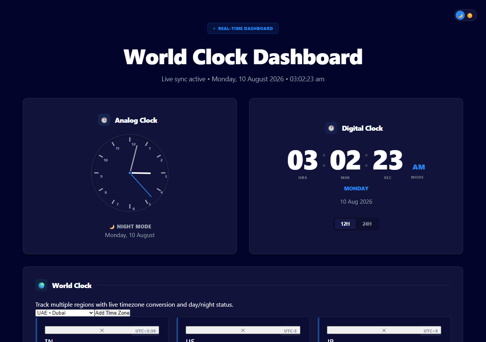

# 🌍 World Clock Dashboard

A beautiful, interactive real-time World Clock Dashboard built with React. Features a clean, modern UI with support for both light and dark themes, analog and digital clocks, world timezones, an alarm system, and a stopwatch.

## ✨ Features

- **Live Real-Time Sync**: Accurate time tracking with live visual indicators.
- **Dual Clock Display**: Analog and digital clock interfaces.
- **World Timezones**: Keep track of time across multiple global cities.
- **Alarm System**: Set and manage alarms directly from the dashboard.
- **Stopwatch**: Built-in stopwatch functionality for precise timing.
- **Theme Support**: Toggle seamlessly between Light and Dark modes.
- **Responsive Design**: Optimized for different screen sizes and devices.

## 🛠 Tech Stack

- **Framework**: [React 18](https://reactjs.org/) (v18.2.0)
- **Tooling**: [Create React App](https://create-react-app.dev/) (react-scripts v5.0.1)
- **Styling**: Vanilla CSS (CSS Variables, Flexbox, CSS Grid)
- **Testing**: React Testing Library

## 🚀 Getting Started

### Prerequisites

Make sure you have [Node.js](https://nodejs.org/) installed on your machine.

### Installation

1. Clone the repository:
   ```bash
   git clone https://github.com/abhijeetnardele24-hash/world-clock-dashboard-final-.git
   ```

2. Navigate into the project directory:
   ```bash
   cd world-clock-dashboard-final-
   ```

3. Install dependencies:
   ```bash
   npm install
   ```

4. Start the development server:
   ```bash
   npm start
   ```

Open [http://localhost:3000](http://localhost:3000) to view it in your browser. The page will reload when you make changes.

## 📦 Build for Production

To build the app for production, run:
```bash
npm run build
```
This builds the app for production to the `build` folder. It correctly bundles React in production mode and optimizes the build for the best performance.

## 🤝 Contributing

Contributions, issues and feature requests are welcome! Feel free to check the [issues page](https://github.com/abhijeetnardele24-hash/world-clock-dashboard-final-/issues).

## 📄 License

This project is licensed under the [MIT License](LICENSE).

---

> **Screenshot Placeholder:**  
> 
