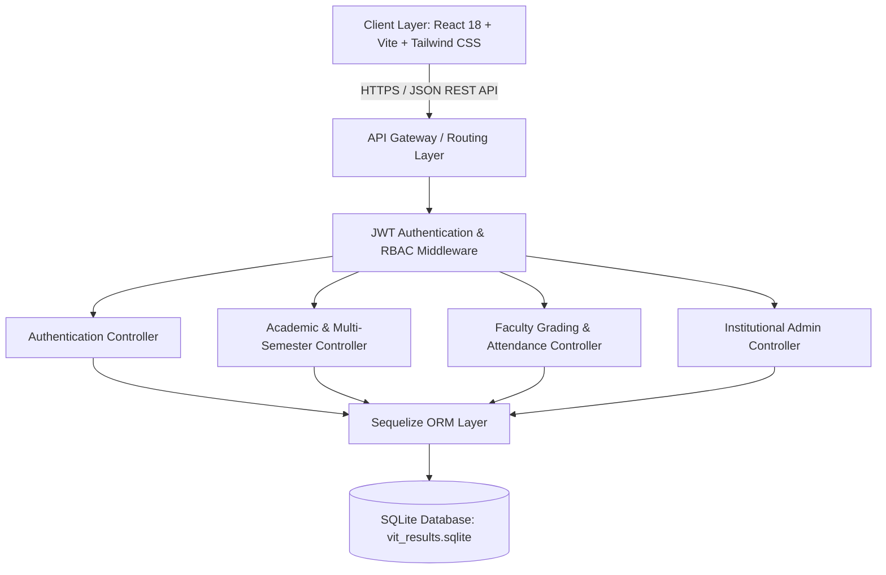
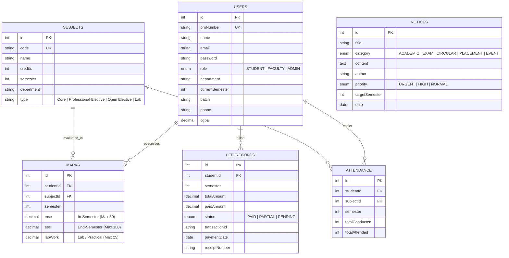

# Vishwakarma Institute of Technology (VIT) - Academic ERP System

Production-grade Academic Enterprise Resource Planning (ERP) and Multi-Semester Result Evaluation System engineered for higher education institutions. Built with a decoupled client-server architecture featuring React, Node.js/Express, Sequelize ORM, and SQLite.

---

## 1. System Architecture

### 1.1 High-Level Architecture



### 1.2 Entity-Relationship (ER) Schema



---

## 2. Core Functional Modules

### 2.1 Multi-Semester Academic Engine
- **Semester Traversal**: Support for Semesters 1 through 8 with historical grade indexing.
- **Credit & Weight Calculation**: Standardized In-Semester (30% weight from 50 max marks) and End-Semester (70% weight from 100 max marks) aggregation.
- **Letter Grade Mapping**:
  - `S` (90-100%): 10.0 Grade Points
  - `A` (80-89%): 9.0 Grade Points
  - `B` (70-79%): 8.0 Grade Points
  - `C` (60-69%): 7.0 Grade Points
  - `D` (50-59%): 6.0 Grade Points
  - `E` (40-49%): 5.0 Grade Points
  - `F` (<40%): 0.0 Grade Points (Backlog / KT flag)
- **Official Transcript Generation**: Print-optimized CSS media queries formatting institutional grade cards for PDF archiving and hardcopy distribution.

### 2.2 Attendance Tracking & Defaulter Radar
- Real-time aggregate and subject-level lecture/lab attendance monitoring.
- Automated debarment threshold enforcement (< 75% attendance criteria).
- Batch classroom attendance recording interface with single-click status inversion.

### 2.3 Examination & Hall Ticket Issuance
- Digital admit card generation linked to candidate PRN and examination session.
- Automated gatekeeping: Verifies full fee clearance (`status: PAID`) and attendance compliance (&ge; 75%) prior to hall ticket release.

### 2.4 Financial & Fee Management
- Detailed ledger breakdown covering Tuition, College Development, Lab/Infrastructure, and Examination fees.
- Verification receipts with transaction hash references.

### 2.5 Institutional Administration & Course Builder
- Comprehensive user provisioning with Role-Based Access Control (RBAC).
- Curriculum course catalog management across departments and semesters.
- Centralized broadcast circular publisher with priority flagging.

---

## 3. REST API Specification

### Authentication (`/api/auth`)
| Method | Endpoint | Description | Access |
| :--- | :--- | :--- | :--- |
| `POST` | `/api/auth/login` | Authenticate user credentials and return JWT bearer token | Public |

### Academic Operations (`/api/academic`)
| Method | Endpoint | Description | Access |
| :--- | :--- | :--- | :--- |
| `GET` | `/api/academic/overview` | Fetch student CGPA, total credits, backlog count, and attendance | Student |
| `GET` | `/api/academic/results?semester={sem}` | Retrieve subject breakdown, scaled marks, and SGPA | Student |
| `GET` | `/api/academic/attendance?semester={sem}` | Retrieve subject attendance and defaulter status | Student |
| `GET` | `/api/academic/hall-ticket` | Generate examination admit card with eligibility check | Student |
| `GET` | `/api/academic/fees` | Retrieve fee ledger records and payment status | Student |
| `GET` | `/api/academic/notices` | Fetch active university circulars and notices | Authenticated |
| `GET` | `/api/academic/curriculum` | List full syllabus catalog across all semesters | Authenticated |

### Faculty Evaluation (`/api/marks`)
| Method | Endpoint | Description | Access |
| :--- | :--- | :--- | :--- |
| `GET` | `/api/marks/students/search` | Query student roster filtered by PRN, Name, or Semester | Faculty, Admin |
| `GET` | `/api/marks/student/:studentId` | Fetch candidate marks for grading | Faculty, Admin |
| `PUT` | `/api/marks/update` | Batch update In-Semester, End-Semester, and Lab marks | Faculty, Admin |
| `POST`| `/api/marks/attendance/batch` | Record class attendance batch records | Faculty, Admin |
| `GET` | `/api/marks/analytics` | Retrieve class average CGPA and defaulter list | Faculty, Admin |

### Institutional Administration (`/api/admin`)
| Method | Endpoint | Description | Access |
| :--- | :--- | :--- | :--- |
| `GET` | `/api/admin/stats` | Retrieve total students, faculty, courses, and system health | Admin |
| `GET` | `/api/admin/users` | List all provisioned accounts across roles | Admin |
| `POST`| `/api/admin/users` | Create new Student, Faculty, or Admin account | Admin |
| `PUT` | `/api/admin/users/:id` | Update user metadata or reset credentials | Admin |
| `DELETE`| `/api/admin/users/:id` | Purge user and cascade related academic records | Admin |
| `POST`| `/api/admin/subjects` | Add new subject to semester syllabus | Admin |
| `DELETE`| `/api/admin/subjects/:id` | Remove subject from curriculum | Admin |
| `POST`| `/api/admin/notices` | Publish institutional announcement | Admin |
| `DELETE`| `/api/admin/notices/:id` | Retract circular from noticeboard | Admin |

---

## 4. Technology Stack & Infrastructure

- **Frontend Application**: React 18, Vite 5, Tailwind CSS 3, Axios, React Router v6.
- **Backend Application**: Node.js, Express.js 4, Sequelize ORM 6, JSON Web Tokens (JWT), bcrypt.
- **Database Engine**: SQLite 3 (Zero-configuration, embedded relational database).
- **Styling Architecture**: Vercel/Apple design tokens, print-specific CSS media stylesheets, micro-animations.

---

## 5. Local Setup and Deployment

### 5.1 Prerequisites
- Node.js (v18.0.0 or higher)
- npm (v9.0.0 or higher)
- Git

### 5.2 Installation Steps

1. **Clone the Repository**:
   ```bash
   git clone https://github.com/abhijeetnardele24-hash/VIT-Semester-Result-Module.git
   cd VIT-Semester-Result-Module
   ```

2. **Backend Setup & Database Seeding**:
   ```bash
   cd backend-node
   npm install
   node seed.js
   npm start
   ```
   *The backend REST service will initialize on `http://localhost:8080`.*

3. **Frontend Client Setup**:
   Open a separate terminal window:
   ```bash
   cd frontend
   npm install
   npm run dev
   ```
   *The client development server will initialize on `http://localhost:5173`.*

---

## 6. Pre-Configured Test Credentials

| Role | Username / PRN | Password | Department / Description |
| :--- | :--- | :--- | :--- |
| **Student** | `23BCE0001` | `password123` | Aarav Sharma (Semester 6, CGPA: 9.15) |
| **Student** | `23BCE0002` | `password123` | Ananya Iyer (Semester 6, CGPA: 9.42) |
| **Student (Defaulter Demo)** | `23BCE0009` | `password123` | Varun Mehta (Semester 6, Low Attendance Demo) |
| **Faculty** | `FACULTY01` | `password123` | Dr. Rajesh Rao (HOD, Computer Engineering) |
| **Faculty** | `FACULTY02` | `password123` | Prof. Sunita Deshpande (Associate Professor) |
| **Admin** | `ADMIN01` | `password123` | Prof. Vikramaditya Shinde (Dean of Academics) |

---

## 7. Security Architecture

- **Stateless Authentication**: Signed JSON Web Tokens (JWT) transmitted via `Authorization: Bearer <token>` headers.
- **Role-Based Access Control (RBAC)**: Route-level middleware validating token claims against required role scopes (`STUDENT`, `FACULTY`, `ADMIN`).
- **Cryptographic Security**: Passwords salted and hashed with `bcrypt` (10 rounds).
- **Data Integrity**: Foreign key constraints and transaction wrappers across student results and attendance records.

---

## 8. License

Distributed under the MIT License. See `LICENSE` for further details.
