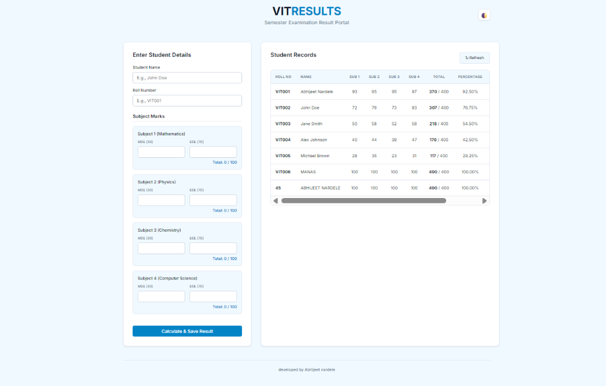
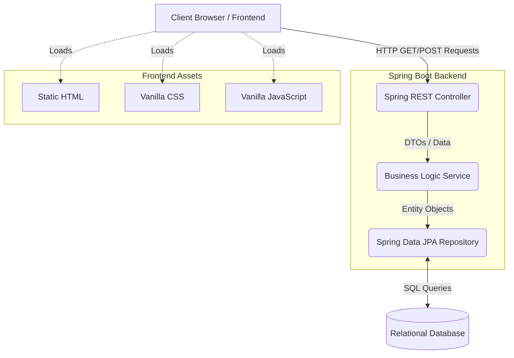

# VIT Student Semester Result Portal (Spring Boot Fullstack)

## Overview

This project is a comprehensive full-stack web application designed to prepare and display the semester results for students of Vishwakarma Institute of Technology (VIT). The application evaluates student performance across four core subjects by calculating a weighted final score based on Mid Semester Examination (MSE) and End Semester Examination (ESE) marks.

### Evaluation Criteria
The final result calculation strictly adheres to the following university weighting system:
- **MSE Marks (Mid Semester Examination):** Accounts for 30% of the total subject grade.
- **ESE Marks (End Semester Examination):** Accounts for 70% of the total subject grade.

### Application Screenshot

## Architecture Diagram

The application follows a standard three-tier Spring Boot MVC architecture to ensure separation of concerns, scalability, and maintainability.

## Detailed Description

### 1. Presentation Layer (Frontend)
The frontend is built using pure **HTML5**, **CSS3**, and **Vanilla JavaScript**. It is fully responsive, ensuring accessibility across both desktop and mobile devices. 
- **HTML/CSS:** Structures the input forms for student data and dynamically displays the result scorecard in a professional table format.
- **JavaScript:** Handles asynchronous API calls (AJAX/Fetch API) to the Spring Boot backend, preventing full page reloads and providing a seamless user experience. It also performs client-side validation to ensure marks entered do not exceed maximum limits.

### 2. Application Layer (Backend)
The backend logic is powered by **Java** and the **Spring Boot** framework.
- **REST Controller:** Exposes API endpoints for the frontend to submit student marks and retrieve processed results.
- **Service Layer:** Contains the core business logic. It receives the raw MSE and ESE scores, applies the 30/70 weightage formula for each of the four subjects, calculates the total percentage, and determines the final pass/fail status and grade.
- **Data Access Layer:** Utilizes Spring Data JPA to interact seamlessly with the underlying database, abstracting away complex SQL queries.

### 3. Data Layer (Database)
The system connects to a relational database to persist student records, marks, and calculated results. This ensures that student data is securely stored and can be retrieved or updated at any time.

## Technology Stack
- **Backend Framework:** Java Spring Boot
- **Frontend:** HTML5, CSS3, JavaScript (ES6+)
- **Build Tool:** Maven
- **Database ORM:** Spring Data JPA / Hibernate
- **Database:** Relational Database (Configured via `application.properties`)

## Setup and Execution Instructions

1. Ensure you have **Java JDK 17** (or higher) and **Maven** installed on your system.
2. Clone the repository and navigate to this project directory.
3. Open a terminal and run the application using the Maven wrapper:
   `./mvnw spring-boot:run` (Linux/Mac) or `mvnw.cmd spring-boot:run` (Windows)
4. Once the Spring Boot application has started, open your web browser.
5. Navigate to `http://localhost:8080` to access the result portal.
