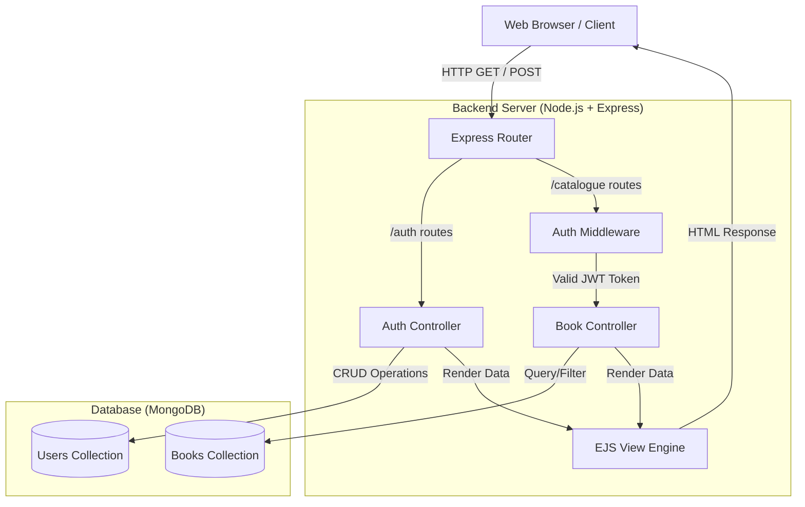

# 📚 Online Book Store

A full-stack, responsive online bookstore built with **Node.js**, **Express**, and **MongoDB**. This project demonstrates modern web development practices including MVC architecture, secure authentication, server-side rendering, and responsive UI design.

## 🏗️ Architecture Diagram



## ✨ Core Features
- **Public & Protected Routes:** Users can browse the home page and catalogue without an account.
- **Secure Authentication:** 
  - User registration with `bcrypt` password hashing.
  - Login system generating a JSON Web Token (JWT).
  - Secure state management using HTTP-only cookies to prevent XSS attacks.
- **Catalogue & Filtering:** Server-side search and category filtering for books.
- **Responsive UI:** Custom CSS implementation ensuring the site looks great on Mobile, Tablet, and Desktop (Grid/Flexbox layouts).
- **Error Handling:** Centralized error handling and query-parameter-based flash messaging for form validation feedback.

## 💾 Database Schema

### User Model
| Field | Type | Description |
|---|---|---|
| `name` | String | User's full name (Required) |
| `email` | String | Unique email address (Required) |
| `password` | String | Hashed password via bcrypt (Required) |
| `date` | Date | Account creation timestamp |

### Book Model
| Field | Type | Description |
|---|---|---|
| `title` | String | Book title (Required) |
| `author` | String | Author name (Required) |
| `description`| String | Short summary of the book |
| `price` | Number | Cost of the book (Required) |
| `coverImage` | String | URL to the book's cover image |
| `genre` | String | Category (e.g., Fiction, Sci-Fi, Tech) |
| `createdAt` | Date | Timestamp when book was added |

## 📁 Folder Structure
```
online-bookstore/
├── config/
│   └── db.js                 # MongoDB connection setup
├── models/
│   ├── User.js               # Mongoose User schema
│   └── Book.js               # Mongoose Book schema
├── controllers/
│   ├── authController.js     # Handles login/register logic
│   └── bookController.js     # Handles catalogue and search logic
├── middleware/
│   └── authMiddleware.js     # JWT verification middleware
├── routes/
│   ├── authRoutes.js         # Authentication endpoints
│   └── bookRoutes.js         # Catalogue endpoints
├── views/
│   ├── partials/             # Reusable UI components (Nav, Footer)
│   ├── home.ejs              # Landing page
│   ├── login.ejs             # Login form
│   ├── register.ejs          # Registration form
│   └── catalogue.ejs         # Book grid and search
├── public/
│   ├── css/
│   │   └── style.css         # Responsive styling
│   └── js/
│       └── main.js           # Client-side interactivity
├── seed.js                   # Database seeding script
├── server.js                 # App entry point
├── .env.example              # Environment variable template
├── package.json              # Project dependencies
└── README.md                 # Project documentation
```

## 🚀 Setup Instructions

1. **Clone the repository:**
   ```bash
   git clone <your-repo-url>
   cd "Assignment 6"
   ```

2. **Install dependencies:**
   ```bash
   npm install
   ```

3. **Environment Setup:**
   Create a `.env` file based on `.env.example`:
   ```env
   MONGO_URI=mongodb://127.0.0.1:27017/bookstore
   JWT_SECRET=your_super_secret_jwt_key_here
   PORT=3000
   ```

4. **Start MongoDB:**
   Ensure your local MongoDB instance is running, or replace `MONGO_URI` with a MongoDB Atlas cloud URI.

5. **Seed Database (Optional but recommended):**
   ```bash
   node seed.js
   ```

6. **Run the Development Server:**
   ```bash
   npm run dev
   ```

7. **Visit the App:**
   Open your browser and navigate to [http://localhost:3000](http://localhost:3000)

## 🛠️ Tech Stack
- **Backend:** Node.js, Express.js
- **Database:** MongoDB, Mongoose
- **Frontend:** EJS (Server-Side Templating), Vanilla CSS, Vanilla JavaScript
- **Security:** jsonwebtoken (JWT), bcryptjs

## 👨‍💻 Author
**[Your Name]**  
[Course/Subject Name]  
[College]
